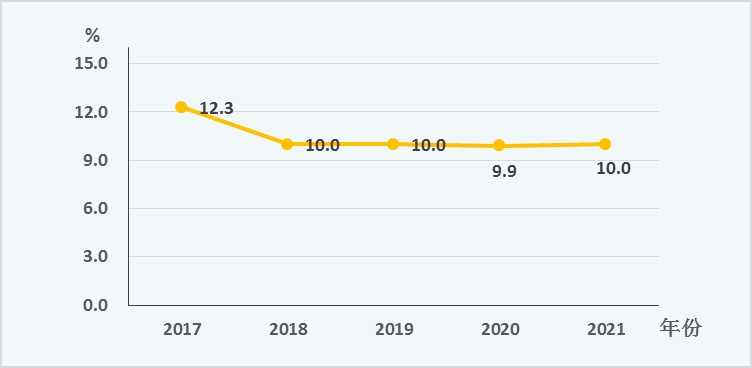
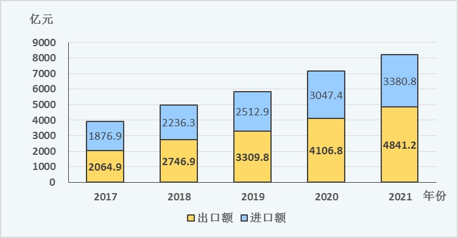
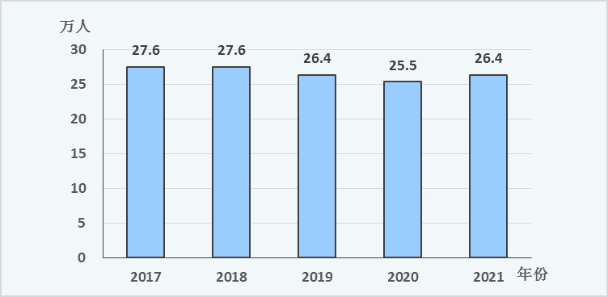
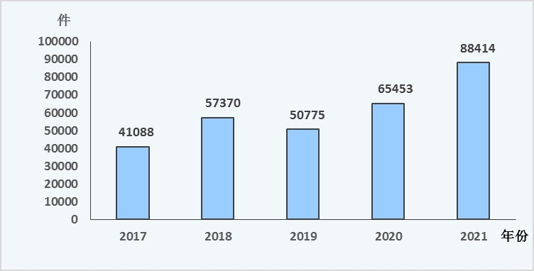
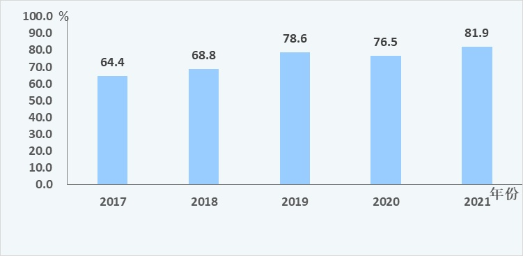

# 2021年成都市国民经济和社会发展统计公报

成都市统计局 国家统计局成都调查队

2022年3月25日

2021年，面对复杂严峻的国际环境和国内疫情散发等多重挑战，成都市坚定以习近平新时代中国特色社会主义思想为指导，深入贯彻习近平总书记重要讲话重要指示精神，认真落实中央、省、市各项决策部署，坚持稳中求进工作总基调，有力统筹推进疫情防控和经济社会发展，扎实做好“六稳”工作，全面落实“六保”任务，经济发展总体平稳、稳中有进，社会大局保持稳定，实现“十四五”良好开局。

## 一、综合

## （一）地区生产总值

根据地区生产总值统一核算初步结果，全年实现地区生产总值（GDP）19917.0亿元，按可比价格计算，比上年增长 8.6% 。其中，第一产业增加值582.8亿元，增长 4.8% ；第二产业增加值6114.3亿元，增长 8.2% ；第三产业增加值13219.9亿元，增长 9.0% 。三次产业对经济增长的贡献率分别为 2.0% 、 28.6% 和 69.4% 。三次产业结构为 2.9:30.7:66.4 。按常住人口计算，人均地区生产总值94622元，增长 6.7% 。

<!-- Page Page 2 -->

表1：2021年地区生产总值及其增长速度

<table><tr><td>指标</td><td>2021年（亿元）</td><td>比上年增长（%）</td></tr><tr><td>地区生产总值</td><td>19917.0</td><td>8.6</td></tr><tr><td>第一产业</td><td>582.8</td><td>4.8</td></tr><tr><td>第二产业</td><td>6114.3</td><td>8.2</td></tr><tr><td>第三产业</td><td>13219.9</td><td>9.0</td></tr></table>

图1：2017—2021年地区生产总值及其增长速度

## （二）财政税收

全年完成一般公共预算收入1697.9亿元，比上年增长 11.7% 。其中税收收入完成1272.9亿元，增长 12.6% ，占一般公共预算收入比重达 75.0% ，比上年提高0.7个百分点。一般公共预算支出完成2237.6亿元，增长 3.6% 。税务部门组织税费收入5288.2亿元，其中组织税收收入（不含海关代征）3275.9亿元，增长 12.0% 。

<!-- Page Page 3 -->

图2：2017—2021年一般公共预算收入及其增长速度

## （三）固定资产投资

全年全社会固定资产投资比上年增长 10.0% 。分产业看，第一产业投资增长 10.3% ；第二产业投资增长 9.8% ，其中工业投资增长 9.7% ；第三产业投资增长 10.0% 。分经济类型看，国有经济投资增长 1.7% ；非国有经济投资增长 14.6% 。基础设施投资下降 4.1% 。重点区域投资较快增长，四川天府新区成都直管区、成都东部新区完成投资分别增长 16.3% 、 20.0% 。

图3：2017—2021年固定资产投资增长速度

<!-- Page Page 4 -->

## （四）物价

全年居民消费价格（CPI）比上年上涨 0.5% ，其中交通和通信类上涨 4.3% ，医疗保健类上涨 2.7% ，教育文化和娱乐类上涨 0.2% ，食品烟酒类下降 1.1% 。商品零售价格上涨 1.1% 。

表2：2021年居民消费价格指数（上年 = 100 1

<table><tr><td>指标</td><td>指数</td></tr><tr><td>居民消费价格</td><td>100.5</td></tr><tr><td>其中:食品烟酒</td><td>98.9</td></tr><tr><td>衣着</td><td>98.5</td></tr><tr><td>居住</td><td>99.9</td></tr><tr><td>生活用品及服务</td><td>101.1</td></tr><tr><td>交通和通信</td><td>104.3</td></tr><tr><td>教育文化和娱乐</td><td>100.2</td></tr><tr><td>医疗保健</td><td>102.7</td></tr><tr><td>其他用品和服务</td><td>101.1</td></tr></table>

## （五）人口

年末常住人口2119.2万人，比上年末增加24.5万人，增长 1.2% 。其中，城镇常住人口1684.3万人，常住人口城镇化率 79.5% ，比上年末提高0.7个百分点。年末户籍人口1556.2万人，比上年末增加36.5万人，户籍人口城镇化率 67.9% 。

## 二、国民经济各行业

## （一）农林牧渔业

全年实现农林牧渔业总产值942.6亿元，按可比价格计算，

<!-- Page Page 5 -->

比上年增长 5.0% 。其中种植业616.6亿元，增长 3.5% ；林业22.1亿元，下降 4.8% ；畜牧业237.2亿元，增长 9.8% ；渔业30.3亿元，增长 0.7% 。粮食产量230.6万吨，增长 1.2% ；经济作物中蔬菜及食用菌、中草药材、水果、茶叶产量分别增长 3.5% 、 8.5% 、 0.6% 、 0.5% 。生猪出栏416.9万头，增长 4.1% 。肉类产量45.2万吨，增长 2.4% 。

全年农作物播种面积1095.9万亩，比上年增长 0.2% 。粮食作物播种面积572.8万亩，增长 0.8% ；经济作物播种面积523.1万亩，下降 0.3% ，其中油料作物播种面积201.6万亩，下降 0.04% ；蔬菜及食用菌播种面积266.3万亩，增长 1.7% ；中草药材播种面积22.2万亩，增长 1.9% 。

新建成高标准农田32.8万亩，高效节水灌溉面积7.4万亩。全市农业适度规模经营率达 72.3% 。

## （二）工业和建筑业

全年规模以上工业增加值比上年增长 11.4% 。五大先进制造业合计增长 11.2% ，其中电子信息产业增长 20.4% ，医药健康产业增长 10.7% ，装备制造产业增长 8.0% ，绿色健康产业增长 5.9% ，新型材料产业下降 3.0% 。规模以上高技术制造业增加值增长 18.3% ，其中计算机及办公设备制造业、电子及通信设备制造业分别增长 43.1% 、 10.8% 。

全年实现建筑业增加值1417.0亿元，比上年增长 2.2% 。施工

<!-- Page Page 6 -->

总承包和专业承包建筑企业竣工产值2305.6亿元。房屋施工面积30146.1万平方米，竣工面积6565.1万平方米，房屋竣工率21.8%。

表3：2021年主要工业产品产量及其增长速度

<table><tr><td>产品名称</td><td>单位</td><td>产量</td><td>比上年增长(%)</td></tr><tr><td>汽车</td><td>万辆</td><td>62.6</td><td>15.1</td></tr><tr><td>电子计算机整机</td><td>万台</td><td>9735.8</td><td>30.8</td></tr><tr><td>移动通信手持机(手机)</td><td>万台</td><td>680.3</td><td>25.0</td></tr><tr><td>集成电路</td><td>亿块</td><td>90.3</td><td>31.4</td></tr><tr><td>饲料</td><td>万吨</td><td>378.4</td><td>2.1</td></tr><tr><td>乳制品</td><td>万吨</td><td>63.2</td><td>-2.6</td></tr><tr><td>卷烟</td><td>亿支</td><td>910.8</td><td>1.7</td></tr><tr><td>白酒</td><td>万千升</td><td>18.6</td><td>7.9</td></tr><tr><td>皮革鞋靴</td><td>万双</td><td>1593.2</td><td>-16.6</td></tr><tr><td>木质家具</td><td>万件</td><td>1223.2</td><td>13.8</td></tr><tr><td>农用氮、磷、钾化学肥料</td><td>万吨</td><td>17.2</td><td>-2.6</td></tr><tr><td>化学药品原药</td><td>万吨</td><td>4.3</td><td>16.3</td></tr><tr><td>中成药</td><td>万吨</td><td>2.6</td><td>-7.6</td></tr><tr><td>塑料制品</td><td>万吨</td><td>82.5</td><td>-10.2</td></tr><tr><td>水泥</td><td>万吨</td><td>1355.8</td><td>-13.4</td></tr><tr><td>平板玻璃</td><td>万重量箱</td><td>3224.5</td><td>4.4</td></tr><tr><td>钢材</td><td>万吨</td><td>566.6</td><td>4.1</td></tr><tr><td>#无缝钢管</td><td>万吨</td><td>19.7</td><td>14.5</td></tr><tr><td>天然气</td><td>亿立方米</td><td>372.0</td><td>13.1</td></tr><tr><td>发电量</td><td>亿千瓦小时</td><td>592.4</td><td>-7.8</td></tr></table>

## （三）房地产业

全年房地产开发投资比上年增长 10.4%。商品房销售面积

<!-- Page Page 7 -->

（含预售）3644.1万平方米，下降 1.0% ，其中住宅销售面积2614.5万平方米，下降 7.5% 。商品房销售额4685.8亿元，增长 4.8% ，其中住宅销售额3846.6亿元，增长 2.8% 。

表4：2021年房地产开发和销售主要指标及其增长速度

<table><tr><td>指标</td><td>单位</td><td>2021年</td><td>比上年增长(%)</td></tr><tr><td>房地产开发投资</td><td>亿元</td><td>—</td><td>10.4</td></tr><tr><td>#住宅投资</td><td>亿元</td><td>—</td><td>12.8</td></tr><tr><td>商品房竣工面积</td><td>万平方米</td><td>1460.8</td><td>2.9</td></tr><tr><td>#住宅</td><td>万平方米</td><td>897.5</td><td>6.2</td></tr><tr><td>商品房销售面积</td><td>万平方米</td><td>3644.1</td><td>-1.0</td></tr><tr><td>#住宅</td><td>万平方米</td><td>2614.5</td><td>-7.5</td></tr><tr><td>商品房销售额</td><td>亿元</td><td>4685.8</td><td>4.8</td></tr><tr><td>#住宅</td><td>亿元</td><td>3846.6</td><td>2.8</td></tr><tr><td>商品房新开工面积</td><td>万平方米</td><td>3101.7</td><td>-19.3</td></tr><tr><td>#住宅</td><td>万平方米</td><td>1816.6</td><td>-19.7</td></tr></table>

## （四）交通运输邮政仓储业

全年实现交通运输邮政仓储业增加值1016.7亿元，比上年增长 9.9% 。全年旅客周转量831.1亿人公里，增长 8.7% 。其中，铁路旅客周转量59.4亿人公里，增长 26.9% ；公路旅客周转量50.4亿人公里，下降 16.0% ；航空旅客周转量721.3亿人公里，增长 9.7% 。全年货物周转量497.1亿吨公里，增长 9.7% 。其中，铁路运输货物周转量102.4亿吨公里，增长 5.6% ；公路运输货物周转量377.3亿吨公里，增长 10.9% ；航空运输货物周转量17.4

<!-- Page Page 8 -->

亿吨公里，增长 10.4% 。

表5：2021年交通运输量及其增长速度

<table><tr><td>指标</td><td>单位</td><td>2021年</td><td>比上年增长(%)</td></tr><tr><td>全年货物周转量</td><td>亿吨公里</td><td>497.1</td><td>9.7</td></tr><tr><td>#铁路</td><td>亿吨公里</td><td>102.4</td><td>5.6</td></tr><tr><td>航空</td><td>亿吨公里</td><td>17.4</td><td>10.4</td></tr><tr><td>公路</td><td>亿吨公里</td><td>377.3</td><td>10.9</td></tr><tr><td>全年旅客周转量</td><td>亿人公里</td><td>831.1</td><td>8.7</td></tr><tr><td>#铁路</td><td>亿人公里</td><td>59.4</td><td>26.9</td></tr><tr><td>航空</td><td>亿人公里</td><td>721.3</td><td>9.7</td></tr><tr><td>公路</td><td>亿人公里</td><td>50.4</td><td>-16.0</td></tr></table>

全年邮政业务总量189.3亿元，比上年增长 24.4% ；快递业务收入165.7亿元，增长 18.9% ；快递业务量18.3亿件，增长 27.4% 。

## （五）批发零售业和住宿餐饮业

全年实现社会消费品零售总额9251.8亿元，比上年增长 14.0% 。按经营地统计，实现城镇消费品零售额8868.1亿元，增长 13.4% ；乡村消费品零售额383.7亿元，增长 27.4% 。按消费形态统计，商品零售7632.6亿元，增长 9.1% ；餐饮收入1619.2亿元，增长 44.0% 。限额以上企业通过互联网实现商品零售额、餐饮收入增长 22.7% 、 48.1% 。

16大类限额以上企业商品零售额中，15个大类实现正增长。其中文化办公用品类比上年增长 23.3% ，粮油、食品、饮料、烟

<!-- Page Page 9 -->

酒类增长 9.4% ，体育娱乐用品类增长 6.1% 。消费升级类商品智能家用电器和音像器材类、新能源汽车零售额分别增长 169.7% 、 122.1% 。

## （六）金融业、证券业和保险业

全年实现金融业增加值2271.6亿元，比上年增长 6.1% 。年末金融机构本外币存款余额47968亿元，比上年末增长 9.9% ；金融机构本外币贷款余额46425亿元，比上年末增长 12.8% 。

表6：2021年末全部金融机构存贷款余额及其增长速度

<table><tr><td>指标</td><td>2021年末（亿元）</td><td>比上年末增长（%）</td></tr><tr><td>金融机构人民币存款余额</td><td>46639</td><td>10.4</td></tr><tr><td>#住户存款</td><td>19020</td><td>11.3</td></tr><tr><td>非金融企业存款</td><td>15120</td><td>7.5</td></tr><tr><td>金融机构人民币贷款余额</td><td>45140</td><td>13.7</td></tr><tr><td>#短期贷款余额</td><td>5412</td><td>14.8</td></tr><tr><td>中长期贷款余额</td><td>25822</td><td>13.8</td></tr><tr><td>金融机构本外币存款余额</td><td>47968</td><td>9.9</td></tr><tr><td>#住户存款</td><td>19190</td><td>11.2</td></tr><tr><td>金融机构本外币贷款余额</td><td>46425</td><td>12.8</td></tr></table>

年末共有境内外上市及过会企业141家，其中A股上市公司101家，新增上市企业21家；共有证券公司4家、期货公司3家、证券投资咨询公司3家、证券公司分公司65家、基金公司分公司13家、证券营业部207家、期货营业部26家。全年股票市场上市融资281.8亿元；证券交易额15.6万亿元，比上年增

<!-- Page Page 10 -->

长 19.9% 。

全年原保险保费收入1004.5亿元，比上年增长 2.1% 。其中，财产保险公司原保险保费收入312.3亿元，增长 0.4% ；人身保险公司原保险保费收入692.2亿元，增长 2.9% 。各类保险赔偿与给付支出394.8亿元，增长 30.5% 。其中，财产保险公司赔偿与给付支出193.7亿元，增长 16.9% ；人身保险公司赔偿与给付支出201.1亿元，增长 46.9% 。

## 三、对外经济

## （一）战略通道

全年新开通5条国际货运航线，国际（地区）航线增至131条，旅客、货邮吞吐量分别达4447.2万人次和64.9万吨，双流国际机场旅客吞吐量4011.7万人次，居全国第二；天府国际机场正式通航投运，旅客吞吐量435.5万人次。开行国际班列4250列，成都始发的中欧班列新增连接境外城市10个、总数达68个。

## （二）对外贸易

全年实现货物进出口总额8222.0亿元，比上年增长 14.8% 。其中出口总额4841.2亿元，增长 17.9% ；进口总额3380.8亿元，增长 10.7% 。对“一带一路”沿线国家实现进出口总额2599.6亿元，增长 16.8% ，占全市进出口总额的 31.6% ；对东盟、欧盟进出口总额分别增长 13.3% 、 11.6% 。实现高新技术产品出口总额3669.8亿元，增长 8.4% 。

<!-- Page Page 11 -->

图4：2017—2021年货物进出口总额

## （三）交流合作

全年新设外商投资企业713家，在蓉世界500强企业312家。外商投资实际到位504.5亿元，新设或增资1000万美元以上的重大外资企业138个。在蓉设立领事机构的国家21个，国际友城和国际友好合作关系城市104个。

## （四）自贸试验区

自贸试验区全年新增企业52548户、新增注册资本3058.4亿元；其中新增外资企业382户、新增注册资本118.2亿元。自贸试验区全年实现货物进出口总额505.4亿元。

## 四、人民生活和民生保障

## （一）居民收入

全体居民人均可支配收入45755元，比上年增长 8.7% 。城镇居民人均可支配收入52633元，增长 8.3% 。其中工资性收入30974元，增长 7.5% ；经营净收入5209元，增长 11.8% ；财产

<!-- Page Page 12 -->

净收入5407元，增长 10.7% ；转移净收入11043元，增长 8.0% 。人均消费性支出31581元，增长 9.9% 。农村居民人均可支配收入29126元，增长 10.2% 。其中工资性收入14438元，增长 10.3% ；经营净收入7251元，增长 9.8% ；财产净收入2823元，增长 11.6% ；转移净收入4613元，增长 9.5% 。人均消费性支出20460元，增长 10.6% 。城乡居民人均收入倍差为1.81，比上年缩小0.03。

图5：2017—2021年城镇及农村居民人均可支配收入

## （二）社会就业

全年城镇新增就业26.4万人，城镇失业人员再就业11.9万人，就业困难人员实现就业1.5万人。城镇登记失业率 2.88% 。农村富余劳动力向非农产业新增转移就业人数8.6万人，农村劳动力劳务输出人数224.4万人。

<!-- Page Page 13 -->

图6：2017—2021年城镇新增就业人数

## （三）社会保障

年末全市参加城镇职工基本养老保险人数1209.8万人，比上年末增加249.0万人；城乡居民养老保险参保人数313.1万人。年末2.2万城镇居民、7.5万农村居民享受最低生活保障，全年保障资金投入7.8亿元，其中投入农村5.7亿元。公共服务投资比上年增长 43.8% ，教育、卫生投资分别增长 18.2% 、 89.0% 。年末共有各种社区服务设施3229处，社区服务中心258个；各类社会福利机构300个，拥有床位4.4万张。

## 五、社会事业

## （一）教育

全年新建、改扩建公办中小学、幼儿园80所，新增学位10.4万个。年末共有在蓉高校65所，在校学生110.2万人，其中本专科学生98.1万人，研究生10.2万人，博士研究生1.8万人，专任教师5.3万人；中等职业教育学校87所，在校学生18.2万

<!-- Page Page 14 -->

人，专任教师0.9万人；普通中学645所，在校学生69.1万人，专任教师5.9万人；普通小学642所，在校学生111.8万人，专任教师6.6万人；幼儿园2773所，在园幼儿65.0万人，专任教师4.9万人。

## （二）科学技术

年末拥有国家级创新平台130家、国家企业技术中心54家；全年实施关键核心技术攻关重点研发项目121个；22项科研成果获国家科学技术奖。专利授权88414件，其中发明14996件，实用新型60586件。技术合同成交额1228.0亿元，全市高新技术产业营业收入11692.0亿元，年末共有高新技术企业7821家，比上年末增长 27.8% 。

图7：2017—2021年专利授权量

## （三）文化

年末共有博物馆（含民办）160个，文化馆23个，公共图书馆23个。年末共有广播电视台18座，制作广播电视节目26

<!-- Page Page 15 -->

套；制作电视节目28套。年末共有有线电视用户318.8万户，其中数字电视用户306.5万户。

## （四）卫生健康

年末共有医疗卫生机构12497个，其中医院692个，疾病预防控制中心25个，妇幼保健院21个；新增三甲医院15家、累计54家。医疗卫生机构床位数16.0万张，其中医院、妇幼保健院床位数13.8万张。卫生技术人员21.3万人，其中执业（助理）医师8.0万人，注册护士10.1万人。全年诊疗16198.3万人次。截至年末，全市累计报告新冠肺炎确诊病例915例（境外输入724例），累计出院880人、死亡3人。

## （五）体育

全年成功举办国家级体育赛事36项。积极筹备大运会，大运村22栋单体建筑全面竣工并“开村揭牌”，配套建设13个交通设施项目全部完工。年末共有全民健身路径9120条，全市惠民行动“1+2”农民健身工程4508个。全年参与全民健身活动1800万人次。

## 六、城市治理和应急能力

## （一）基础设施

年末全市建成区面积1314.0平方公里，其中中心城区建成区面积992.0平方公里。年末城市道路面积1.2亿平方米。全年供水总量18.6亿立方米，其中居民家庭用量8.9亿立方米。城镇污水处

<!-- Page Page 16 -->

理率 93.9% 。天然气供应量75.2亿立方米，管道燃气居民用户数785万户。完成生活垃圾无害化处理691.3万吨，无害化处理率 100% 。

全年新建公路386公里，年末公路总里程29520公里，等级公路28236公里，其中高速公路通车里程1240公里。年末机动车保有量633.6万辆，比上年末增长 4.9% ；其中私人汽车拥有量460.5万辆，增长 4.3% 。

年末全市公交线路长度16799.1公里，公共汽车营运线路1180条，比上年末增加9条；市辖区公交营运汽车14819辆。轨道交通运营线路长度558公里，其中地铁运营线路长度518.5公里；全年地铁客运总量17.9亿乘次，比上年增长 47.7% 。

## （二）安全生产

全年发生各类生产安全事故243起，比上年下降 11.3% ；死亡人数249人，下降 2.0% ；亿元地区生产总值生产安全事故死亡率为0.013人，下降 12.2% 。全年交通事故1477起，下降 16.3% ；死伤人数1577人，下降 9.4% ；直接经济损失362.0万元，下降 26.9% 。火灾事故9861起，增长 3.1% ；直接财产损失6575.5万元。

## （三）环境保护

全市地表水I～III类水质断面占比为 97.4% ，比上年提升2.0个百分点；锦江流域优良水体比例达到 100% ，市控以上断面全

<!-- Page Page 17 -->

面达标；县城及以上集中式饮用水水源地水质达标率 100% 。全年空气质量优良天数299天，优良天数比例 81.9% 。

龙泉山城市森林公园增绿增景1.6万亩，新建各级绿道780公里、累计达到5188公里。构建全域公园体系，“百个公园”示范工程110个项目全部开工、建成开放86个。全面建立林长制，修复大熊猫栖息地5.1万亩，实施全域增绿项目2888个，新增绿地1861公顷、立体绿化23.8万平方米，森林覆盖率达到 40.3% 。建成首批天府蓝网示范项目96.7公里。

图8：2017—2021年空气优良天数比例

表7：2017—2021年锦江流域市控及以上断面水环境质量

<table><tr><td>年份</td><td>Ⅰ～Ⅲ类水质 比例（%）</td><td>Ⅳ～Ⅴ类水质 比例（%）</td><td>劣Ⅴ类水质 比例（%）</td></tr><tr><td>2017年</td><td>73.8</td><td>23.8</td><td>2.4</td></tr><tr><td>2018年</td><td>78.6</td><td>16.6</td><td>4.8</td></tr><tr><td>2019年</td><td>92.9</td><td>7.1</td><td>0.0</td></tr><tr><td>2020年</td><td>100.0</td><td>0.0</td><td>0.0</td></tr><tr><td>2021年</td><td>100.0</td><td>0.0</td><td>0.0</td></tr></table>

<!-- Page Page 18 -->

注释：

[1]公报中各项数据为初步统计数。部分数据因四舍五入的原因，存在总计与分项合计不等的情况。

[2]公报中地区生产总值、各产业增加值绝对数按当年价格计算，增长速度按可比价格计算。

[3]公报中2020年地区生产总值按照最终核算数进行了修订。

[4]公报中航空运输货物周转量数据包含3家货运航空公司数据。

[5]公报中邮政行业业务总量按2020年不变单价计算，同比增长按照可比口径计算。

[6]公报中在蓉高校数包含成人高校、非成都市级教育事业统计编码高校、新建高校。在蓉高校师生数为成都市级教育事业统计编码高校师生数。

[7]公报中年末共有有线电视用户不包括电信、移动、联通的电视用户。

[8]公报中中心城区建成区面积统计范围为“11+2”区域，即四川天府新区、成都高新区、锦江区、青羊区、金牛区、武侯区、成华区、龙泉驿区、青白江区、新都区、温江区、双流区、郫都区。

[9]公报中市辖区公交营运汽车数量统计范围为四川天府新区、成都高新区、锦江区、青羊区、金牛区、武侯区、成华区、龙泉驿区、青白江区、新都区、温江区、双流区、郫都区、新津区。

[10]公报中空气质量数据2017年、2018年采用国家认可的标识数据，2019年至2021年采用国家认可的实况数据。

[11]公报中交通运输、邮政、金融、对外贸易、财政税收、保险、证券、教育、科技、文化、卫生、体育、环境保护、安全生产、人民生活和社会保障等数据来源于相关部门。