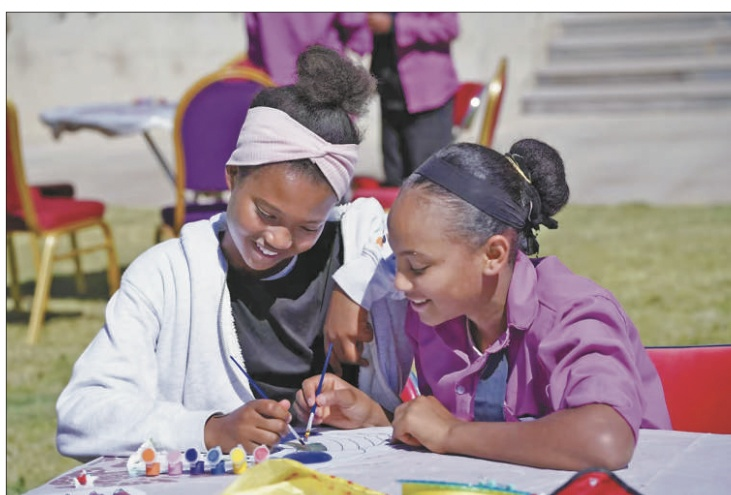

# 助力双方交往 搭建友谊桥梁

本报记者 沈小晓 任 彦 黄培昭

身着中国传统民族服装的厄立特里亚青年依次登台表演中国民族舞、现代舞、扇子舞等，曼妙的舞姿赢得现场观众阵阵掌声。这是日前厄立特里亚高等教育与研究院孔子学院(以下简称“厄特瓦院”)举办“喜迎新年”中国歌舞比赛的场景。

中国和厄立特里亚传统友谊深厚。近年来，在高质量共建“一带一路”框架下，中厄两国人文交流不断深化，互利合作的民意基础日益深厚。

## “学好中文，我们的未来不是梦”

“鲜花曾告诉我你怎样走过，大地知道你心中的每一个角落·…·.”厄立特里亚阿斯马拉大学综合楼二层，一阵优美的歌声在走廊里回响。循着熟悉的旋律轻轻推开一间教室的门，学生们正跟着老师学唱中文歌曲《同一首歌》。

这是厄特瓦院阿斯马拉大学教学点的一节中文歌曲课。为了让学生们更好地理解歌词大意，老师尤斯拉·穆罕默德萨尔·侯赛因逐字翻译和解释歌词。随着伴奏声响起，学生们边唱边随着节拍摇动身体，现场气氛热烈。

“这是中文歌曲初级班，共有32人。学生大部分来自首都阿斯马拉的中小学，年龄最小的仅有6岁。”尤斯拉告诉记者。

尤斯拉今年23岁，是厄立特里亚一所公立学校的艺术老师。她12岁开始在厄特瓦院学习中文，在2017年第十届“汉语桥”世界中学生中文比赛中获得厄立特里亚赛区第一名，并和同伴代表厄立特里亚前往中国参加决赛，获得团体优胜奖。2022年起，尤斯拉开始在厄特瓦院兼职教授中文歌曲，每周末两个课时。“中国文化博大精深，我希望我的学生们能够通过中文歌曲更好地理解中国文化。”她说。

“姐姐，你想去中国吗？”“非常想！我想去看故宫、爬长城。”尤斯拉的学生中有一对能歌善舞的姐妹，姐姐露姬今年15岁，妹妹莉娅14岁，两人都已在厄特瓦院学习多年，中文说得格外流利。

露姬对记者说：“这些年来，怀着对中文和中国文化的热爱，我们姐妹俩始终相互鼓励，一起学习。我们的中文一天比一天好，还学会了中文歌和中国舞。我们一定要到中国去。学好中文，我们的未来不是梦！”

据厄特瓦院中方院长黄鸣飞介绍，这所书院成立于2013年3月，由贵州财经大学和厄立特里亚高等教育与研究院合作建立，开设了中国语言课程和中国文化课程，注册学生2万余人次。10余年来，厄特瓦院已成为当地民众了解中国的一扇窗口。

黄鸣飞表示，随着来学习中文的人日益增多，阿斯马拉大学教学点已难以满足教学需要。2024年4月，由中企蜀道集团所属四川路桥承建的孔院教学楼项目在阿斯马拉开工建设，预计今年上半年竣工，建成后将为厄特瓦院提供全新的办学场地。

## “在中国学习的经历让我看到更广阔的世界”

多年来，厄立特里亚广大赴华留学生和培训人员积极投身国家建设，成为助力该国发展的人才和中厄友好的见证者和推动者。

在厄立特里亚全国妇女联盟工作的约翰娜·特韦尔德·凯莱塔就是其中一位。她曾在中华女子学院攻读硕士学位，研究方向是女性领导力与社会发展。其间，她实地走访中国多个地区，获得了观察中国社会发展的第一手资料。

谈起在中国求学的经历，约翰娜记忆犹新：“中国的发展在当今世界是独一无二的。沿着中国特色社会主义道路坚定前行，中国创造了发展奇迹，这一切都离不开中国共产党的领导。中国的发展经验值得许多国家学习借鉴。”

正在西南大学学习的厄立特里亚博士生穆卢盖塔·泽穆伊对中国怀有深厚感情。8年前，在北京师范大学获得硕士学位后，穆卢盖塔在社交媒体上写下这样一段话：“这是我人生的重要一步，自此我拥有了一双坚固的鞋子，赋予我穿越荆棘的力量。”

穆卢盖塔密切关注中国在经济、科技、教育等领域的发展，“中国在科研等方面的实力与日俱增。在中国学习的经历让我看到更广阔的世界，从中受益匪浅。”

23岁的莉迪亚·埃斯蒂法诺斯已在厄特瓦院学习3年，在中国书法、中国画等方面表现十分优秀，在2024年厄立特里亚赛区的“汉语桥”比赛中获得一等奖。莉迪亚说：“学习中国书法让我的内心变得安宁和纯粹。我也喜欢中国的服饰，希望未来能去中国学习，把中国不同民族元素融入服装设计中，创作出更多精美作品，也把厄特文化分享给更多的中国朋友。”

在厄立特里亚不久前举办的第六届中国风筝文化节上，当地小学生体验风筝制作。

中国驻厄立特里亚大使馆供图

“不管远近都是客人，请不用客气；相约好了在一起，我们欢迎你·…·.”在一场中厄青年联谊活动上，四川路桥中方员工同当地大学生合唱《北京欢迎你》。厄立特里亚技术学院计算机科学与工程专业学生鲁夫塔·谢拉是其中一名演唱者，她很早便在孔院学习中文，一直在为去中国留学作准备。“这句歌词是我们两国人民友谊的生动写照。无论是投身于厄立特里亚基础设施建设的中企员工，还是在中国留学的厄立特里亚学子，两国人民携手努力，必将推动两国关系不断向前发展。”鲁夫塔说。

厄立特里亚高等教育委员会主任助理萨马瑞表示：“每年我们都会组织学生到中国访问学习，目前有超过5000名厄立特里亚学生在中国留学。学习中国的教育经验，有助于提升厄立特里亚的教育水平。”

## “共同向世界展示非洲和亚洲的灿烂文明”

从阿斯马拉出发，沿着蜿蜒曲折的盘山公路一路向东寻找丝路印迹。驱车两个小时，记者来到位于厄立特里亚港口城市马萨

瓦的北红海省博物馆。

博物馆二层陈列着一个发掘自阿杜利斯古城的中国古代陶制酒器，罐身上写着“万”“和”“禅”“山”等汉字。“这件文物证明，很早以前我们就通过海上丝绸之路进行贸易往来与文化交流。这也是厄立特里亚与中国友好交往历史的有力证明。”北红海省博物馆研究与文献部负责人伊萨亚斯·特斯法兹吉说。

厄立特里亚国家博物馆考古学和人类学研究员菲尔蒙·特韦尔德十分喜爱中国文化。他表示：“学习彼此的语言和文化，将帮助厄中两国人民更好地理解彼此，助力双方交往，搭建友谊桥梁。”

厄立特里亚国家博物馆馆长塔吉丁·努里达姆·优素福曾多次访问中国，对中华文明的传承与创新、现代化博物馆的建设与发展印象深刻。“中国博物馆不仅有许多保存完好的文物，还充分运用先进科技手段进行展示，帮助人们更好理解中华文明。”塔吉丁说，“厄立特里亚与中国都拥有悠久的文明，始终相互理解、相互尊重。我希望未来与中国同行加强合作，共同向世界展示非洲和亚洲的灿烂文明。”